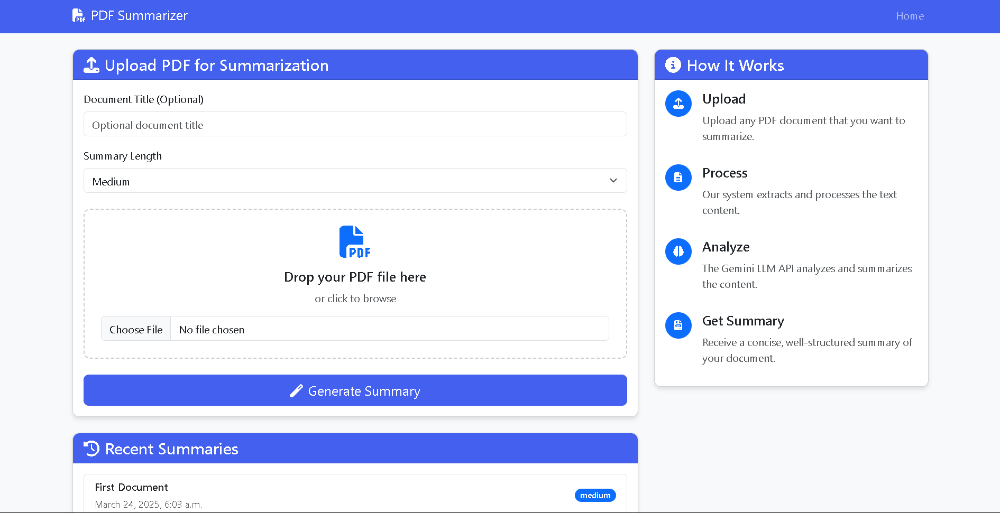
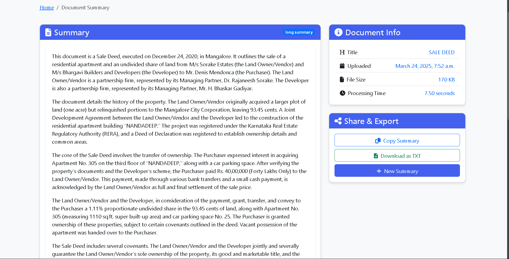
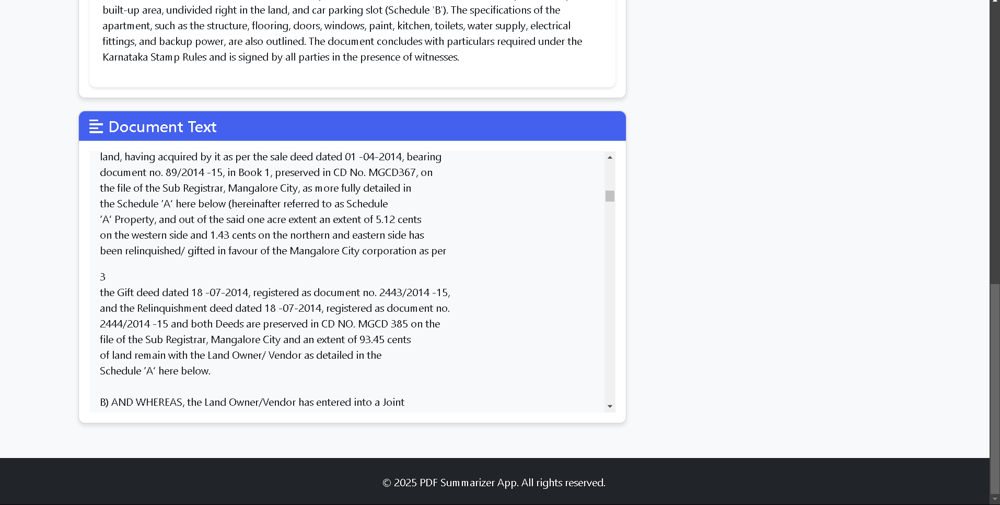
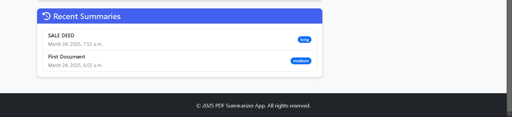

# PDF Summarizer Web Application

A full-stack web application that extracts text from PDF files and generates concise summaries using the Gemini LLM API.

## Features

- **PDF Upload**: Easily upload PDF documents for summarization
- **Text Extraction**: Automatically extract text content from uploaded PDFs
- **Gemini LLM Integration**: Generate concise, high-quality summaries
- **Adjustable Summary Length**: Choose between short, medium, or long summaries
- **Modern UI**: Clean, responsive interface with Bootstrap
- **Database Caching**: Store extracted text and summaries for quick access
- **Error Handling**: Comprehensive error handling and user feedback

## Technologies Used

- **Backend**: Django 5.0
- **Database**: PostgreSQL
- **Text Extraction**: PyPDF2
- **LLM Integration**: Google Generative AI (Gemini)
- **Frontend**: HTML, CSS, Bootstrap 5
- **JavaScript**: Vanilla JS with fetch API

## Installation

### Prerequisites

- Python 3.9+
- PostgreSQL
- Google Gemini LLM API key

### Setup

1. Clone the repository:
   git clone https://github.com/Puneeetth/Pdf_Summarizer.git
   cd pdf-summarizer


2. Create a virtual environment and activate it:
   python -m venv venv
   source venv/bin/activate  # On Windows: venv\Scripts\activate
 

3. Install the dependencies:

   pip install -r requirements.txt
  

4. Create a `.env` file in the project root with the following variables:
 
   SECRET_KEY=your_django_secret_key
   DEBUG=True
   ALLOWED_HOSTS=localhost,127.0.0.1
   
   DB_NAME=pdf_summarizer
   DB_USER=your_db_user
   DB_PASSWORD=your_db_password
   DB_HOST=localhost
   DB_PORT=5432
   
   GEMINI_API_KEY=your_gemini_api_key
   ```

5. Create the PostgreSQL database:
   
   createdb pdf_summarizer
  

6. Run the migrations:
  
   python manage.py migrate
  

7. Create a superuser (optional, for admin access):
   
   python manage.py createsuperuser
  
8. Start the development server:
   
   python manage.py runserver
  

9. Access the application at `http://localhost:8000`

## Getting a Gemini API Key

1. Visit [Google AI Studio](https://makersuite.google.com/app/apikey)
2. Sign in with your Google account
3. Create a new API key
4. Copy the key to your `.env` file

## Usage

1. Upload a PDF file through the web interface
2. Select your desired summary length (short, medium, or long)
3. Click "Generate Summary"
4. View the extracted text and generated summary
5. Copy or download the summary as needed

## Project Structure


pdf_summarizer/
├── core/                  # Main application
│   ├── models.py          # Database models
│   ├── forms.py           # Form handling
│   ├── views.py           # View controllers
│   ├── services/          # Business logic
│   │   ├── pdf_service.py    # PDF text extraction
│   │   └── gemini_service.py # LLM integration
│   └── templates/         # HTML templates
├── static/                # Static assets
├── media/                 # Uploaded files
└── pdf_summarizer/        # Project settings
